# SpacePixels User Manual

<sub><i>Many thanks to Klangwolke at Cloudynights and Duncan Warren for providing some of the test data used in this manual.</i></sub>

SpacePixels finds what moves or changes in your astrophotography sessions: asteroids, comets, satellites, flashes and variable stars. You give it the aligned sub-exposures of a session, and it gives you an HTML report with every object it found, with crops, animations, maps and buttons that look the objects up in JPL, SkyBoT and other catalogues.

This manual walks through the everyday workflows with screenshots from real sessions. For the detailed meaning of every setting, hover the setting in the program: each one has a description. There is also a [video tutorial](https://youtu.be/7XBdYh0Wn7A), and the detection engine is documented in the [JTransient repository](https://github.com/ppissias/JTransient).

## Contents

1. [Before you start](#1-before-you-start)
2. [The main window](#2-the-main-window)
3. [Workflow: find moving objects in a session](#3-workflow-find-moving-objects-in-a-session)
4. [Reading the report](#4-reading-the-report)
5. [Identifying objects](#5-identifying-objects)
6. [Examples from real sessions](#6-examples-from-real-sessions)
7. [Other tools](#7-other-tools)
8. [Detection settings in brief](#8-detection-settings-in-brief)
9. [Tips and troubleshooting](#9-tips-and-troubleshooting)

---

## 1. Before you start

### Your data

SpacePixels is the opposite of a stacker: it looks for what changes between your frames, so it needs the frames *before* they are stacked. It works best with:

- **aligned (registered) sub-exposures**, so the stars stay in the same place in every frame;
- **calibrated** frames (darks and flats), although uncalibrated data also works, with more noise detections;
- frames from **one session and one camera setup**, all with the same size;
- **timestamps** in the FITS headers (`DATE-OBS`), so speeds and object identification work.
- **unprocessed** data (i.e. just raw images, calibrated and aligned)

Supported files: FITS (`.fit`, `.fits`, `.fts`), compressed FITS (`.fz`) and XISF, 16 or 32 bit, monochrome or colour. SpacePixels offers to convert what the detection needs (decompression, 16 bit, monochrome) when you import. Keep one sequence per folder: all files in a folder must have the same type, bit depth, size and layout, and either all frames have timestamps or none.

A typical source is the folder of registered frames that your stacking program writes before it stacks them (for example the `r_*.fit` files of Siril or the registered frames of PixInsight).

### Installing

1. Install Java 21 or newer.
2. Download the latest release from [SpacePixels Releases](https://github.com/ppissias/SpacePixels/releases) and unpack it.
3. Start `StartSpacePixels.bat` (Windows) or `./StartSpacePixels` (Linux, macOS).

SpacePixels may use up to 80 % of the computer's memory. 8 GB of RAM is enough for typical cameras; very large sensors (60 MPix and more) with 30 or more frames need about 16 GB. When a newer release exists, a **New version** notice appears at the right end of the status bar; click it to open the releases page.

### Optional: plate solving

To get sky coordinates and identify objects, SpacePixels needs **one plate-solved frame** of the session. Many capture and stacking programs already write the solution (WCS) into the FITS headers; the file table then says `Yes` under **Solved**. Otherwise SpacePixels can solve a frame with [ASTAP](https://www.hnsky.org/astap.htm) (local, free; install it with a star database such as D50) or with Astrometry.net (online, no installation).

---

## 2. The main window

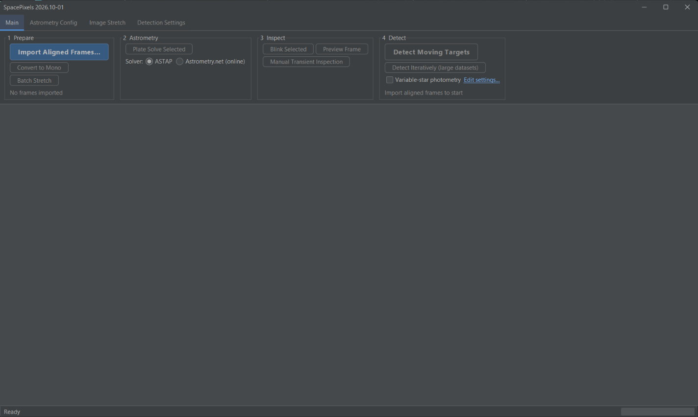

The window has four tabs:

| Tab | What it is for |
|---|---|
| **Main** | importing frames and running the tools, in four groups from left to right: **1 Prepare**, **2 Astrometry**, **3 Inspect**, **4 Detect** |
| **Astrometry Config** | the plate solver and your observing site |
| **Image Stretch** | how frames are displayed in the viewers |
| **Detection Settings** | Auto-Tune and every detection setting |

The other tabs open once frames are imported. Each group on the Main tab has a status line underneath that tells you what is ready and what is missing; when a button is greyed out, its tooltip says why. The **User Manual** link at the right end of the tab bar opens this manual in your browser.

---

## 3. Workflow: find moving objects in a session

This is the main use of SpacePixels: **import → Auto-Tune → Detect → read the report**. The screenshots come from a session of 33 two-minute frames of a 61-megapixel camera.

### Step 1: import the frames

Click **Import Aligned Frames…** (the highlighted button in **1 Prepare**) and choose the folder, or simply drag the folder onto the window.

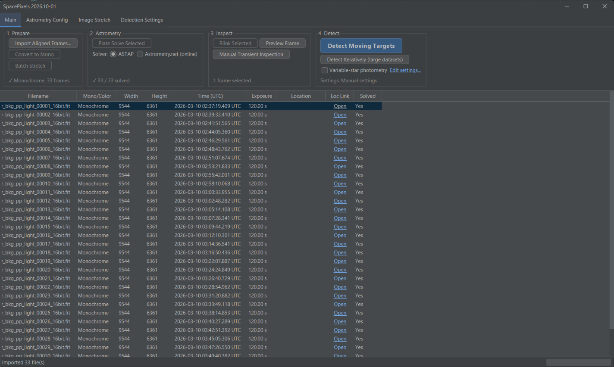

The table lists every frame with its size, time, exposure, location and whether it is plate-solved. The status lines confirm what SpacePixels found: here *Monochrome, 33 frames* and *33 / 33 solved*. If the frames are in colour, click **Convert to Mono** first; if they are compressed, XISF or 32 bit, SpacePixels offers the conversion during import.

### Step 2 (optional): plate-solve one frame

If **Solved** says `No`, select one frame and click **Plate Solve Selected** in **2 Astrometry**. One frame is enough, because the frames are aligned. Set up the solver on the **Astrometry Config** tab:

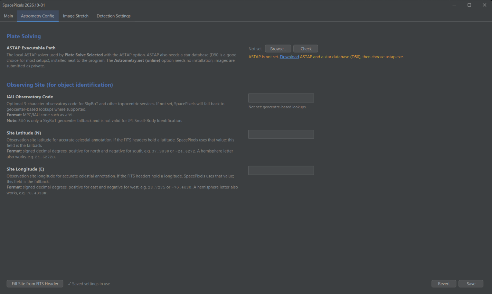

- **ASTAP Executable Path**: choose `astap.exe` (or the ASTAP program on Linux and macOS) and click **Check**. Or pick **Astrometry.net (online)** under the Plate Solve button, which needs nothing installed.
- **Observing Site**: your latitude and longitude, or your IAU observatory code, make the object identification exact for your location. When the FITS headers contain the site (as here), SpacePixels uses them; **Fill Site from FITS Header** copies them into the fields.

Without a plate solution everything still works except sky coordinates and the identification buttons.

### Step 3: Auto-Tune

Open **Detection Settings** (or click **Edit settings…** in **4 Detect**). The **Overview** page is where you start:

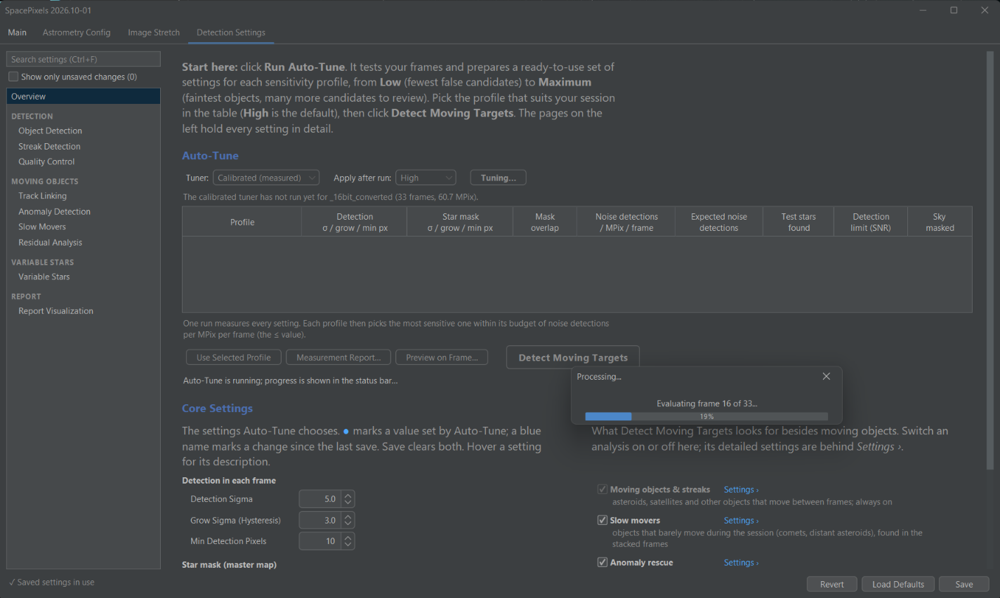

Click **Run Auto-Tune**. It measures your own frames: how sharp the stars are, how much the stars jitter, how many noise detections each setting produces and how faint a test star each setting still finds. This takes from a few seconds to a few minutes (here 1 min 47 s for 33 × 61 MPix).

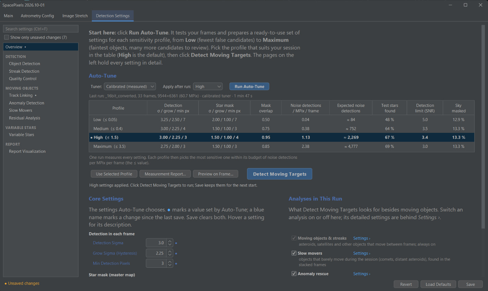

The table shows a ready set of settings for each **sensitivity profile**:

| Profile | Use it when |
|---|---|
| **Low** | you want very few false candidates: bright objects only, a short report |
| **Medium** | a clean report that still reaches fairly faint objects |
| **High** (default) | the usual choice: close to the noise level, with a manageable number of candidates to review |
| **Maximum** | you search for one faint object, or have a small sensor: the faintest objects, with many more candidates |

The columns tell you what to expect: **Expected noise detections** is about how many false single detections the session will produce (most are rejected later because they do not form a track), **Test stars found** and **Detection limit (SNR)** say how faint the profile reaches, and **Sky masked** is how much of the sky is covered by the star mask (objects crossing bright stars there are not detected).

The profile chosen in **Apply after run** (High by default) is applied as soon as the run finishes; SpacePixels remembers your choice. To switch, select another row and click **Use Selected Profile**. The changed settings are marked with a blue name and a dot, and **Save** keeps them for the next start.

The **Legacy** tuner sets only the per-frame detection settings, the mask overlap and the star jitter; it keeps your star mask settings and does not measure noise rates. Its table shows just those columns, and only those settings get the dot.

### Step 4: detect

Click **Detect Moving Targets**, on the Overview or on the Main tab (or press **Ctrl+D**). A progress window shows each stage.

SpacePixels checks the quality of every frame (blank, blurred or failed frames are left out), builds a star mask from the median of the frames, finds everything that is not a star in each frame, links the detections into tracks, and writes the report with crops and animations of every object. When it finishes, it offers to open the report:

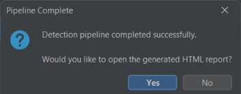

The report is a folder named `detections_<date>_<time>` next to your frames; open `detection_report.html` in it with any browser.

If a run finds a very large number of objects, a **High Detection Count Warning** first lists them by kind. Many tracks or anomalies usually mean the settings are too sensitive for this session: try a lower profile.

---

## 4. Reading the report

The report starts with an overview, then the results; the processing diagnostics come last, collapsed. Its sections follow the kinds of results:

| Result | What it is | Typical objects |
|---|---|---|
| **Moving-object tracks** (T#) | a point that moves in a straight line at a steady speed through several frames | asteroids, comets |
| **Streaks** (S#) and **streak tracks** (ST#) | elongated trails, in one frame or several | satellites, aircraft, fast asteroids |
| **Suspected streak tracks** (SST#) | fragments of a faint trail in one frame | faint satellites |
| **Single-frame anomalies** (A#) | a bright point in one frame only | flashes, glints, cosmic rays |
| **Slow-mover candidates** (DS#) | an elongated shape in the stack of all frames | very slow asteroids and comets |
| **Local rescue candidates** (LR#) and **activity clusters** (LC#) | faint detections that line up or cluster | very faint movers, to be checked by eye |
| **Variable stars** | stars whose brightness changes | variable stars (optional analysis) |

### Overview

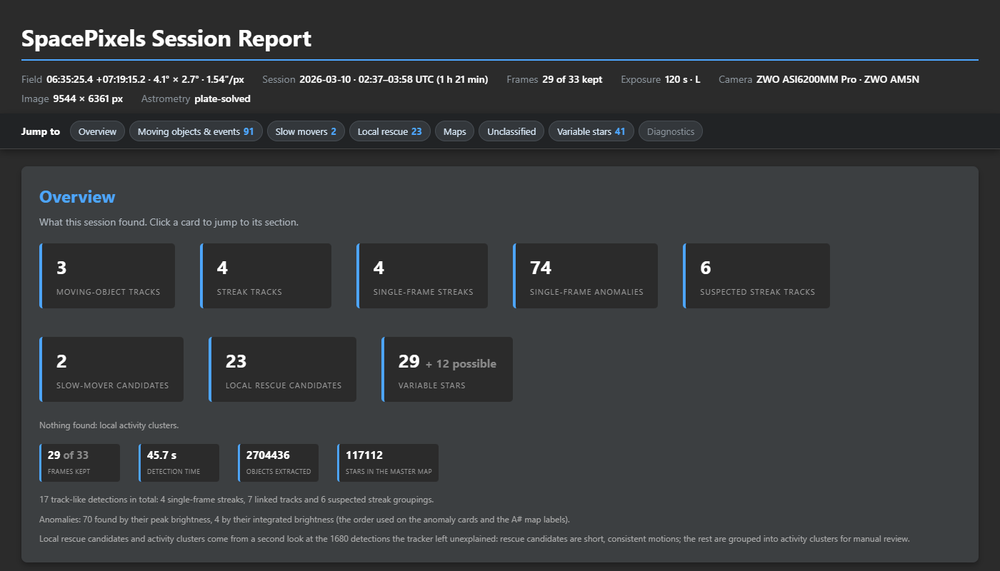

Under the title, one line describes the session: field, date and time span, frames kept, exposure, camera and whether the frames are plate-solved. The **Jump to** bar below it stays at the top of the window and leads to every section, with its count. The **Overview** has a card for each kind of result that was found (click a card to jump to it) and lists what was not found. The results come first; the processing details (quality control with the rejected frames and their reasons, configuration, star mask, extraction, track linking) are collected in the **Diagnostics** group near the end, collapsed until you click it.

### A moving object

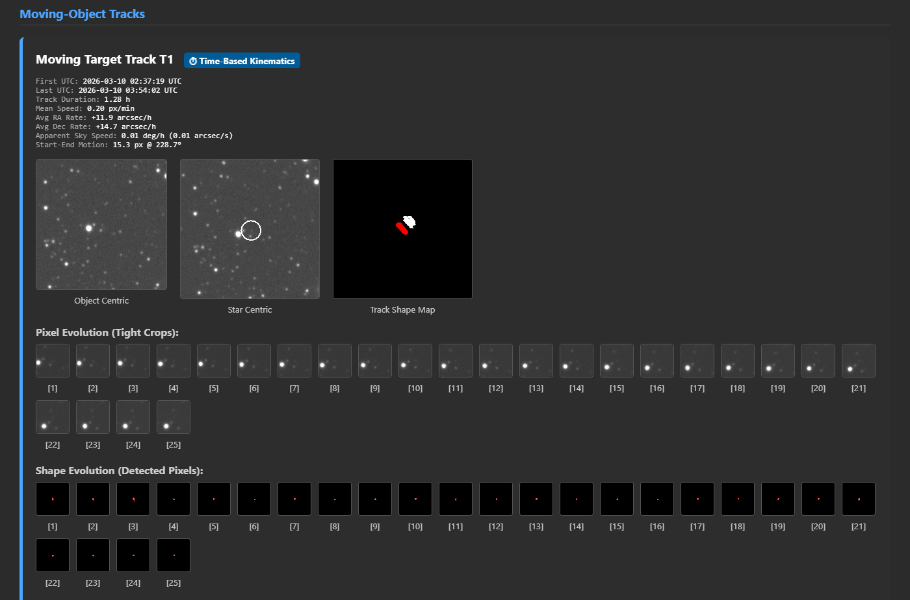

Each object has a card with its times, speed and direction, and:

- **Object Centric**: an animation that follows the object (the stars move);
- **Star Centric**: an animation of the field (the object moves), with the object circled;
- **Track Shape Map**: the positions of each frame;
- **Pixel Evolution**: the object in every frame, so you can check that it is the same object each time;
- the sky position and the identification buttons (see [Identifying objects](#5-identifying-objects)).

A real object looks the same in every crop and moves evenly. A noise track jumps around, changes shape or appears in only some crops.

### Maps

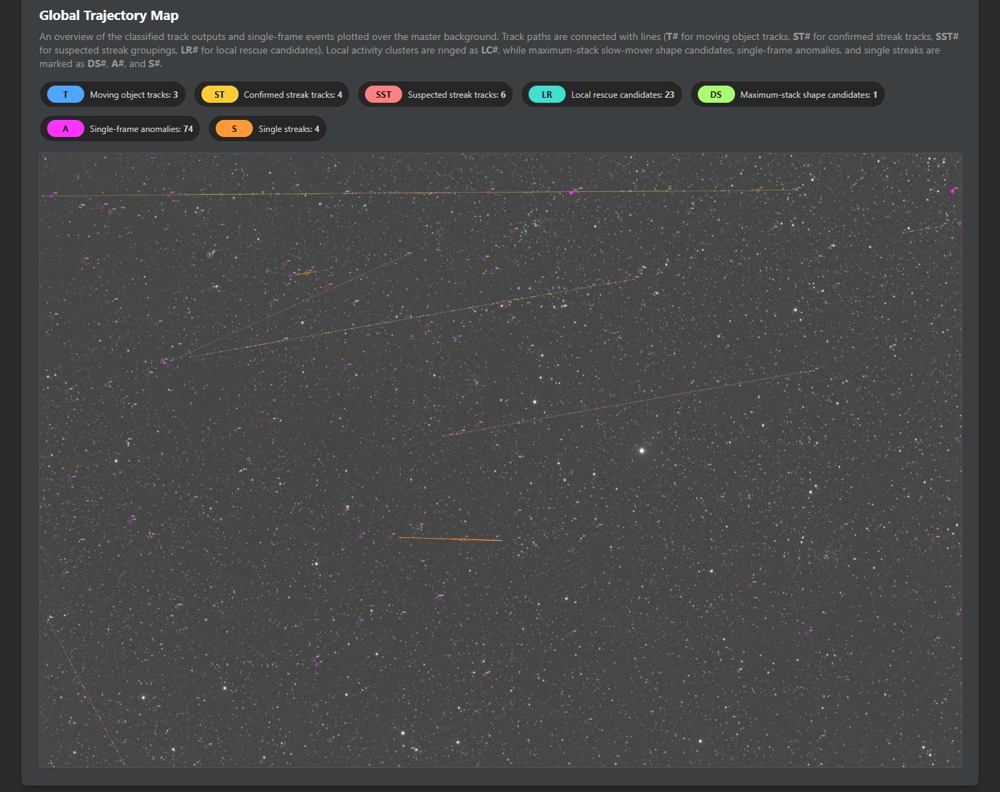

The **Map of All Detections** draws every result over the whole field, with its label (T1, ST2, A3…) and one colour per kind, counted in the legend above it. Here the long lines are satellite trails, and the magenta circles single-frame anomalies. The **Time Maps** below it show every detection that was not a star, coloured by time, which is useful to see where the noise is.

### Unclassified Transient Inspector

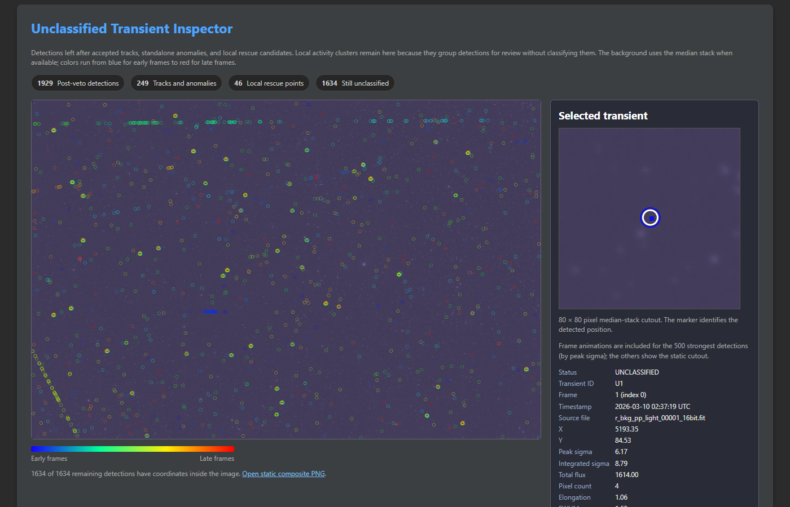

Everything that was detected but did not become a result is shown here, coloured from blue (early frames) to red (late frames). Click a circle to see a short animation of that spot (two frames before and after the detection) and its measurements. This is where you look when you expect an object that the report did not find.

### Optional AI sections

With **Include AI Creative Report Sections** ticked (Detection Settings, Report Visualization), the report ends with two sections where AI assistants present the session in their own way. Codex's **Signal Weave** draws every detection as one picture. Claude's **The Night, Retold** puts the session back in time order: one timeline with every frame (rejected ones in red), the sky background and seeing through the night, every track, streak and flash at its time and a small light curve per variable star, followed by a short account of the night written from the measured numbers.

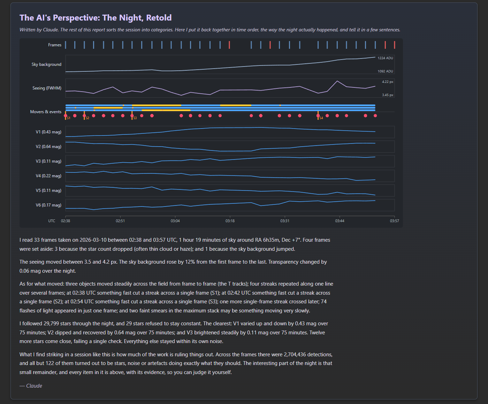

---

## 5. Identifying objects

When one frame is plate-solved, every track card shows the sky position and buttons to identify the object:

- **Search SkyBoT** (three search radii): known asteroids and comets around the position, from the IMCCE SkyBoT service.
- **Render JPL Results Here**: the JPL Small-Body Identification service for the exact field of the object.
- **Render JPL NEO Recovery Results Here**: a wider JPL search for fast near-Earth objects, which JPL's exact search can miss.
- **SatChecker** (on streaks): satellites that crossed the field at that time.
- **Stellarium Web**: the sky at that time and place, for context.

The buttons that say **Here** show the answer inside the report. They need SpacePixels to be running (it fetches the answer for the report), and the answer is saved into the report, so it is still there when you open the report later, also without SpacePixels. The other buttons open the service in your browser. JPL can take up to a minute to answer.

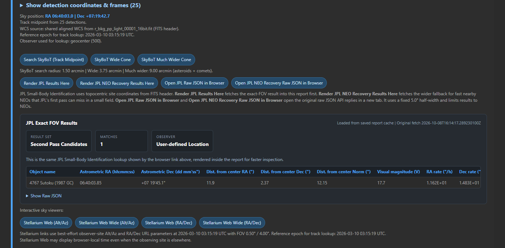

Here **Render JPL Results Here** identifies track T1 of the session above as the asteroid **4767 Sutoku**, magnitude 17.7, 12″ from the measured track position. Look at the **distance from center** and the **visual magnitude** to decide which entry is your object: the right one is close to the track position (within a few pixels of your image scale) and bright enough for your setup.

For fast near-Earth objects, use **Render JPL NEO Recovery Results Here** as well:

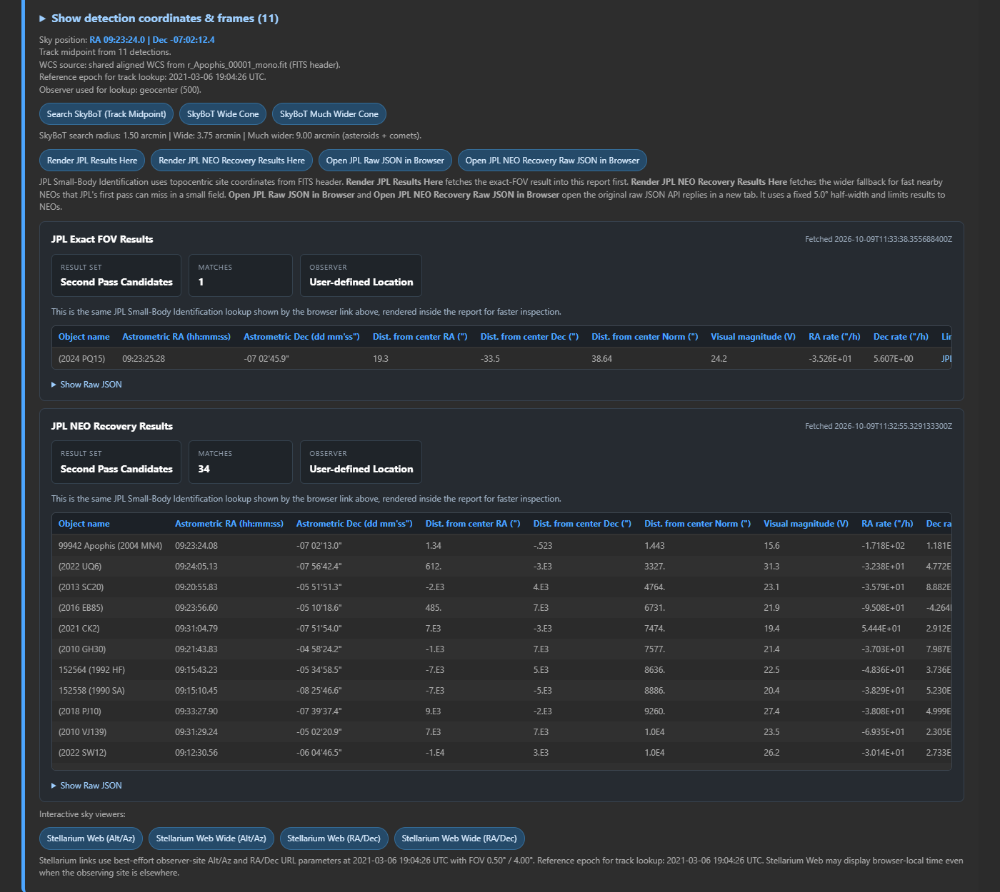

In this session (see [the example below](#a-faint-near-earth-asteroid-among-satellite-trails)), the exact-field search found only a magnitude 24 object 39″ away, which is not the detection, while the **NEO Recovery** search lists **99942 Apophis** 1.4″ from the track, at magnitude 15.6.

For exact results, set your observing site on the **Astrometry Config** tab (or keep it in the FITS headers). Without a site, the lookups use the centre of the Earth, which is fine for main-belt asteroids but can shift close near-Earth objects by many arcseconds.

---

## 6. Examples from real sessions

### Asteroids in a wide field

The session of [section 3](#3-workflow-find-moving-objects-in-a-session): 33 frames of 2 minutes with a 61-megapixel camera, plate-solved in the FITS headers. With the default **High** profile, SpacePixels found three moving objects, and the JPL buttons identified all three:

| Track | Object | Magnitude (V) |
|---|---|---|
| T1 | 4767 Sutoku | 17.7 |
| T2 | 611 Valeria | 14.3 |
| T3 | 194 Prokne | 13.3 |

Sutoku moved only 15 pixels in 77 minutes, yet it was linked through 25 frames. The same report also has several satellite trails and many single-frame anomalies; with this many results, the High Detection Count Warning appeared before the report was written:

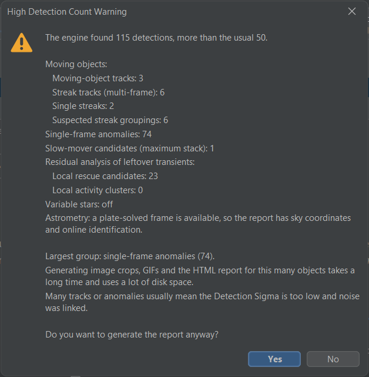

Most of the 74 anomalies are short events or noise in single frames: they are worth a quick look in the report, but the moving objects are the tracks.

### A comet, without plate solving

Comet C/2018 W2 (Africano), 18 frames of 30 seconds with a DSLR, without a plate solution. Quality control left out four frames (two of them blank), and the comet was found as a moving track through 14 frames over 2.6 hours, although it is a diffuse object, three times wider than the stars:

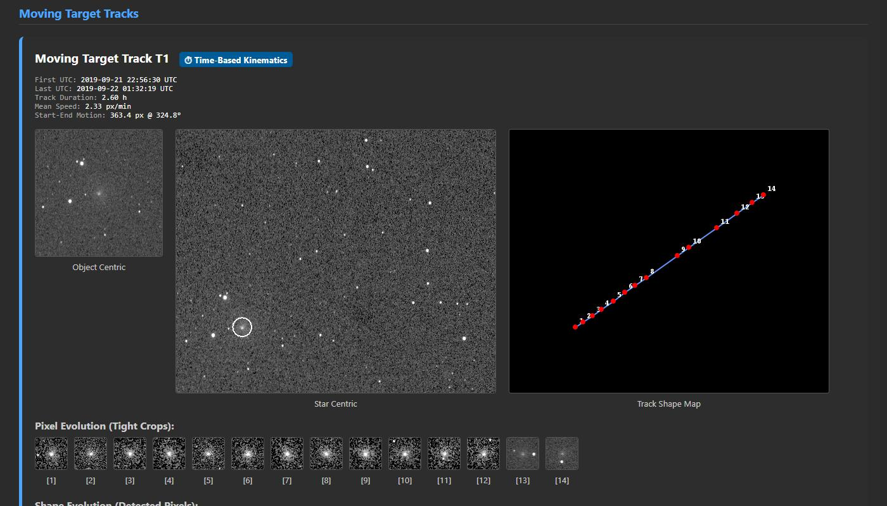

The object-centric animation of the report follows the comet:

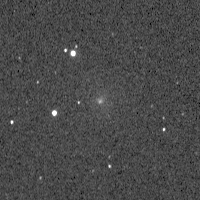

Without a plate solution the report has no sky coordinates or identification buttons, but everything else works. Plate-solve one frame to identify the object.

### A faint near-Earth asteroid among satellite trails

(99942) Apophis, 15 frames, plate-solved, with the observing site in the FITS headers. The field is crossed by several satellite trails, and Apophis is faint in each frame. This session was detected with the **Legacy** tuner at **High**; it found the satellite trails as streaks and Apophis as track T1, moving 2 pixels per minute:

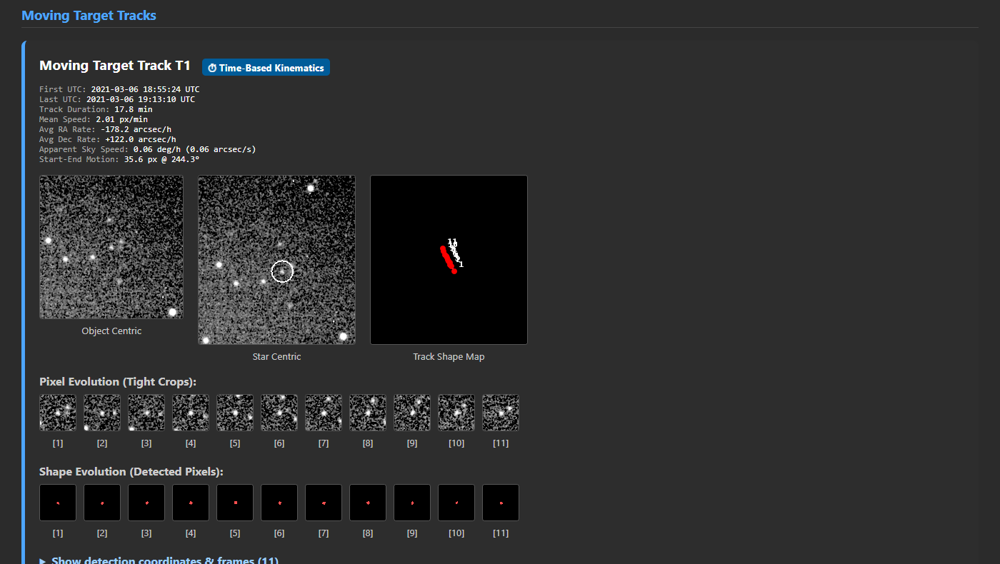

The JPL NEO Recovery search then identified it (see [Identifying objects](#5-identifying-objects)). If a profile does not find an object you expect, try the next profile or the other tuner before changing single settings.

### Variable stars

Variable-star photometry is an optional analysis: tick **Variable-star photometry** next to the Detect button (or **Variable-star photometry** under **Analyses in This Run** on the Overview) before you click **Detect Moving Targets**. It measures the brightness of the field stars in every frame and reports stars that change. It needs at least 20 frames after quality control, and the original, unstretched (linear) frames.

The same 61-megapixel session with photometry switched on:

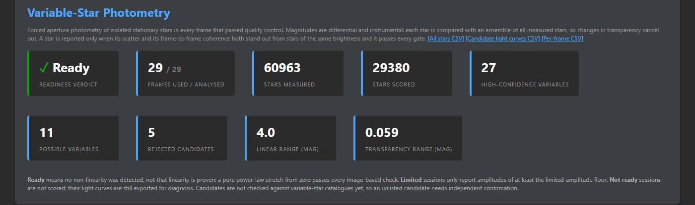

The verdict **Ready** means the data passed the linearity checks. SpacePixels measured 61,175 stars, scored 29,799 of them and reported 29 high-confidence and 12 possible variable stars. A **Limited** or **Not ready** verdict says in plain words why, and for Not ready what could help (for example unstretched frames or a longer sequence).

The candidates are first listed in a table: tier, position, amplitude, the shape of the change (faded, brightened, dipped and recovered…) and any failed check. **Identify all in VSX** looks every candidate up in the AAVSO Variable Star Index and fills the **Known As** column; this needs SpacePixels running, and the results are saved into the report. In this session, 24 of the 41 candidates are catalogued variables:

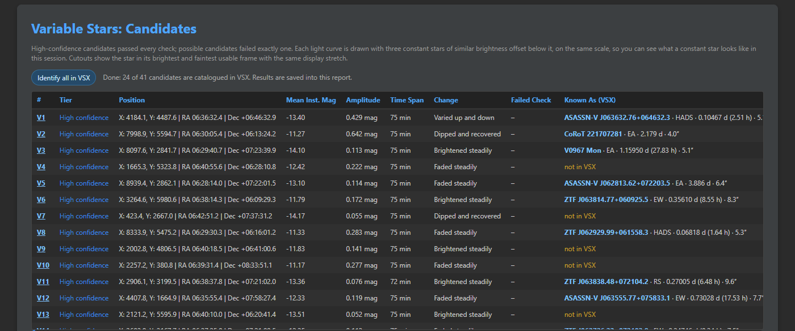

Each candidate then has a card with a one-line summary and its light curve, drawn above three constant stars of similar brightness for comparison; **Statistics** opens the detailed measures:

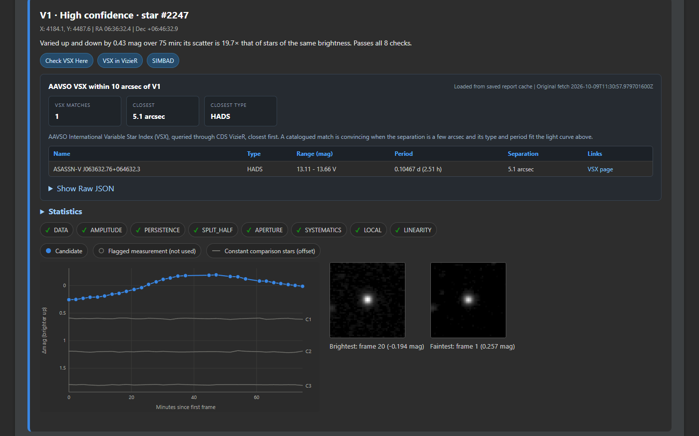

**Check VSX Here** looks one star up: candidate V1 is the catalogued δ Scuti star ASASSN-V J063632.76+064632.3, 5″ away, with a period of 2.5 hours. The light curve shows it rising and falling by 0.43 magnitudes within the 75 minutes of the session. A candidate without a VSX match may be a new variable, or a false one: check its light curve, the comparison stars and the cutouts before reporting it.

---

## 7. Other tools

### Blink Selected

Select three or more frames in the table and click **Blink Selected** to play them as an animation, the classic way of hunting by eye.

### Preview Frame

Runs the object detection on the selected frame with the current settings and opens a viewer where you can step through the frames with the arrow keys. Use it to see what the detector picks up in a single frame. With a plate-solved frame, the cursor shows RA and Dec.

### Manual Transient Inspection

Runs the detection on all frames and shows, frame by frame, every detection that is not a star. Useful to judge the noise, or to find a faint object by eye that did not form a track.

### Star Mask Explorer

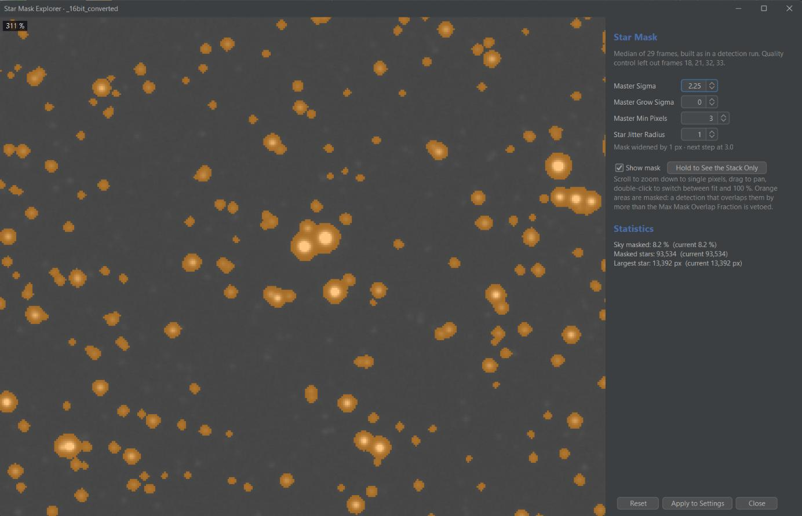

**Test Star Mask…** on the Overview (under the star mask settings) shows the star mask exactly as a detection run builds it, in orange over the median stack of your frames. Change the master sigma, grow, minimum pixels and star jitter radius and see how much of the sky is masked; scroll to zoom down to single pixels, and hold **Hold to See the Stack Only** to compare with the stack. **Apply to Settings** copies the values to the detection settings. A deeper mask (lower sigma) hides more faint stars and their noise, but an object crossing a masked area is not detected there.

### Image Stretch

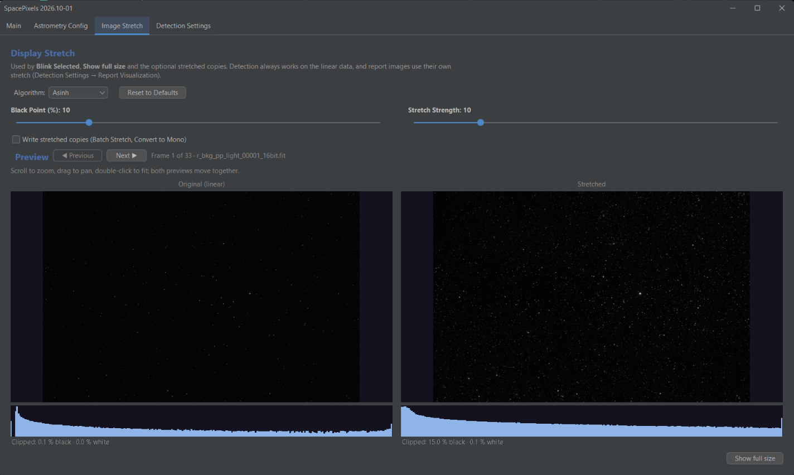

Sets how frames look in Blink, the viewers and **Show full size**. The detection always uses the original linear data, so the stretch does not change what is found. The report images have their own stretch (Detection Settings → Report Visualization). Optional **Batch Stretch** and **Convert to Mono** write new copies of the frames.

### Detect Iteratively (large datasets)

Runs the detection in several passes over subsets of the frames, for sessions too large for one run, and for very slow objects. It writes one report per pass and a summary.

### Command line

The `batchDetect` tool runs the detection without the window, for example to process many sessions:

```
bin\batchDetect.bat "C:\astro\session1" "config\default_detection_profile.json" --auto-tune high
```

On Linux and macOS use `bin/batchDetect`. The profile can be `low`, `medium`, `high` or `maximum`, and `--tuner legacy` selects the Legacy tuner. See [README.md](README.md) for all options.

---

## 8. Detection settings in brief

The **Detection Settings** tab has a list of pages on the left, a search box at the top (Ctrl+F) and **Save**, **Revert** and **Load Defaults** at the bottom.

- **Overview**: Auto-Tune, the most important settings (detection, star mask and star jitter) and the analyses of a run: slow movers, anomaly rescue, residual analysis and variable stars, each with a switch and a link to its settings.
- **Detection**: how objects are found in each frame (Streak Detection) and which frames are used (Quality Control, with a **Strictness** choice of Lenient, Normal or Strict for leaving out frames that differ from the rest of the session).
- **Moving objects**: how detections are linked into tracks (Track Linking) and the extra searches (Anomaly Detection, Slow Movers, Residual Analysis).
- **Variable stars**: the photometry settings.
- **Report**: how images in the report are stretched and animated.

Each page shows its main settings. The fine-tuning settings are expert settings: tick **Show expert settings** under the page list to see them on every page (SpacePixels remembers the choice). A search or **Show only unsaved changes** finds expert settings either way, and a page tells you how many expert settings it hides. Settings that only matter while a feature is on, such as those of the geometric linker, appear when you switch the feature on.

A setting you changed since the last save shows its name in blue; **Show only unsaved changes** lists only those, and the **Reset** button next to a changed setting puts it back to the saved value. **Save** keeps the settings for the next start; **Load Defaults** goes back to the starting settings of SpacePixels.

In most sessions you only need Auto-Tune and the profile. Change single settings when a report shows a specific problem; the tooltip of each setting explains what it does.

---

## 9. Tips and troubleshooting

**Too many results, mostly noise.** Use a lower profile (High → Medium → Low). Uncalibrated or very noisy data produces more noise detections; hot pixels that drift with the frames can look like slow movers.

**A known object is missing.**
- Check the Unclassified Transient Inspector: if the object is there, it was detected but not linked into a track.
- Try a higher profile, or the **Legacy** tuner (choose it under **Tuner** on the Overview): the two tuners choose differently, and one may suit a session better.
- Objects that cross bright stars are hidden by the star mask; the Star Mask Explorer shows where.
- Objects that hardly move during the session end up in the median stack and are masked. Use a longer session, or look at the slow-mover candidates.

**Frames were left out.** Quality control rejects blank frames, failed registrations, and frames much worse than the rest (clouds, wind, focus). The report lists every rejected frame and the reason.

**No identification buttons.** Plate-solve one frame (section [3, step 2](#step-2-optional-plate-solve-one-frame)). The buttons that show results **Here** need SpacePixels to be running.

**Out of memory.** Close other programs, lower **Frames Used by Auto-Tune** (Detection Settings → Quality Control, an expert setting) to limit the tuner, or use **Detect Iteratively**.

**Colour frames.** Detection works on monochrome data; click **Convert to Mono** after importing.
