# SpacePixels 🌌

SpacePixels is a desktop and command-line FITS workflow for finding moving and transient objects in aligned astronomical image sequences. It is built around the JTransient detection engine and is aimed at asteroid, comet, satellite, and transient hunting from amateur data.

Instead of stacking away motion, SpacePixels analyzes the frame-to-frame changes, links detections across time, and exports a full HTML session report with diagnostics, crops, and animations.

More resources:
- [SpacePixels Website](https://startales.eu/SpacePixels/)
- [User Manual](MANUAL.md)
- [Java API Guide](API.md)
- [SpacePixels Wiki](https://github.com/ppissias/SpacePixels/wiki) 

Download the latest packaged release from:

[SpacePixels Releases](https://github.com/ppissias/SpacePixels/releases)

## 🔭 Why I Created SpacePixels: The Opposite of Stacking

In modern astrophotography, our primary goal is almost always to create a single, deep, noise-free image of a deep-sky object. To do this, we take dozens or hundreds of individual sub-exposures and run them through stacking software.

Those stacking algorithms, such as sigma clipping, are incredibly good at doing one specific thing: **throwing away anything that changes between frames**.

But what exactly are we throwing away? Those rejected pixels and artifacts are often real, dynamic events happening above our heads: asteroids, comets, meteors, artificial satellites, and unknown transients. By stacking, we are literally erasing the active universe to look at the static one.

**SpacePixels is the exact opposite of a stacking tool.** It was built to mine that discarded data. Instead of averaging out movement to hide it, SpacePixels actively hunts for movement across your sub-exposures to reveal the hidden transients you captured while you were focused on the deep-sky target.

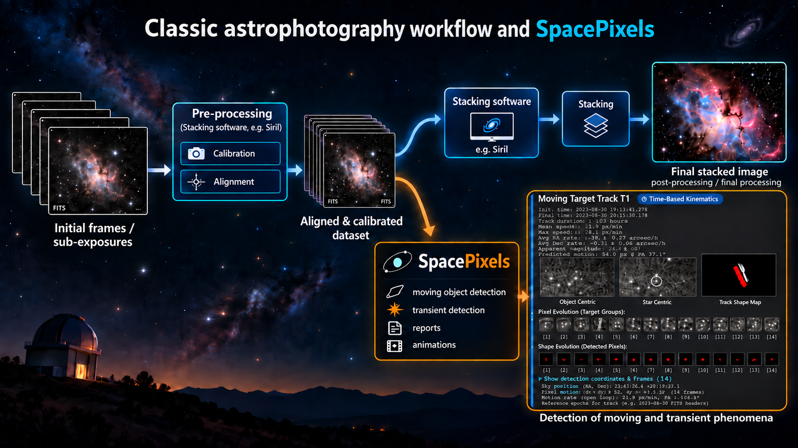
*Overall workflow: aligned frames can be stacked for a final image or analyzed by SpacePixels for moving and transient objects.*

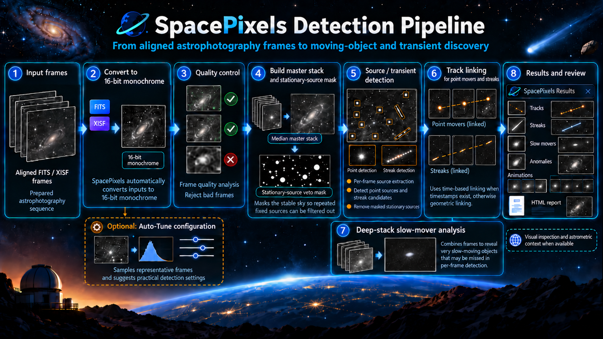
*Detection workflow: SpacePixels checks frames, finds and links candidates, then presents results for review.*

## 📸 Screenshots & Output

Many thanks to Klangwolke at Cloudynights for providing amazing data for this report.

Many thanks to Cloudynights user TheStarsabove for providing data.

Many thanks to [Kumar](https://github.com/chvvkumar) for providing amazing data.

**Check out sample reports.**

<a href="https://startales.eu/various_files/detections_20261004_131720/detection_report_public.html" target="_blank">Sample SpacePixels report -Version 2026.09-01</a> 
<a href="https://startales.eu/various_files/detections_20260327_104057/detection_report.html" target="_blank">Sample SpacePixels report (Apophis)</a>  
<a href="https://startales.eu/various_files/detections_20260327_104830/detection_report.html" target="_blank">Sample SpacePixels report</a>  

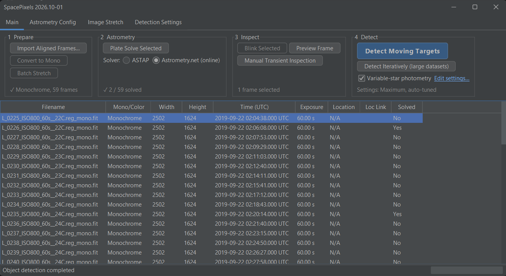
 *The SpacePixels Main Workspace.*

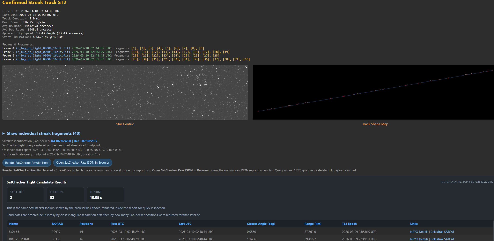
 *Sample Detection - Streak track*

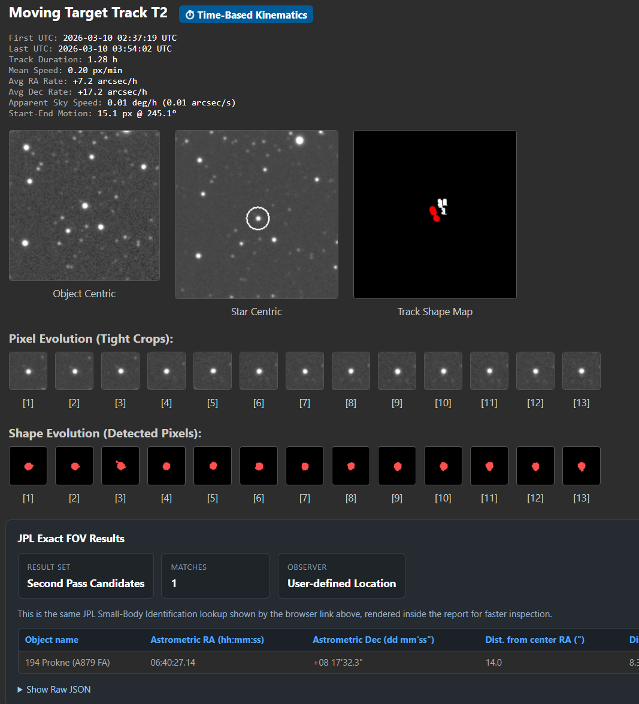
 *Sample Detection - asteroid Prokne (data credit Klangwolke @ Cloudynights)*

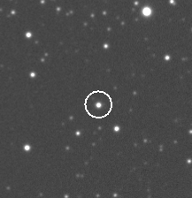
 *Sample Detection - asteroid Prokne (data credit Klangwolke @ Cloudynights)*

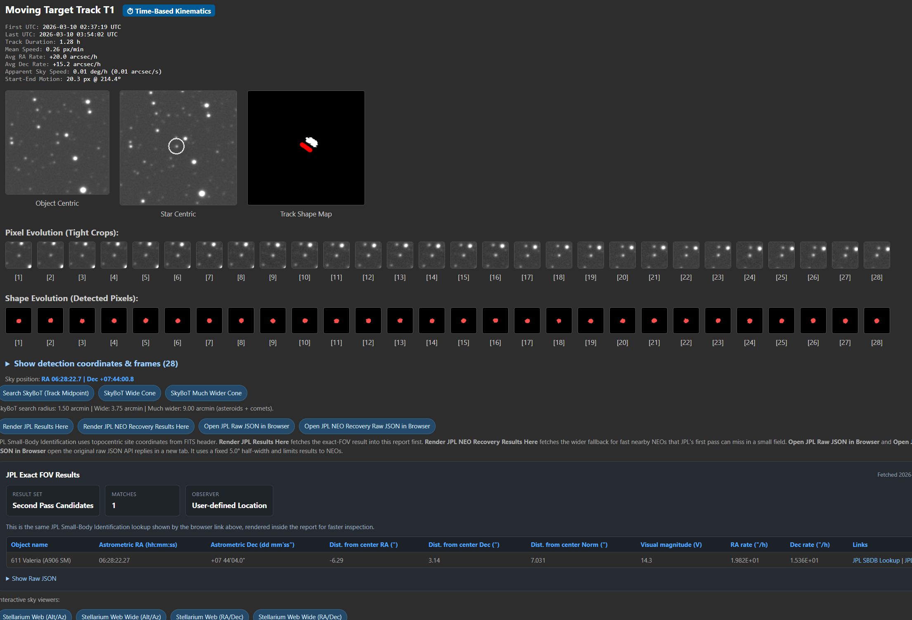
 *Sample Detection - minor planet Valeria (data credit Klangwolke @ Cloudynights)*

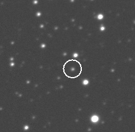
 *Sample Detection - minor planet Valeria (data credit Klangwolke @ Cloudynights)*

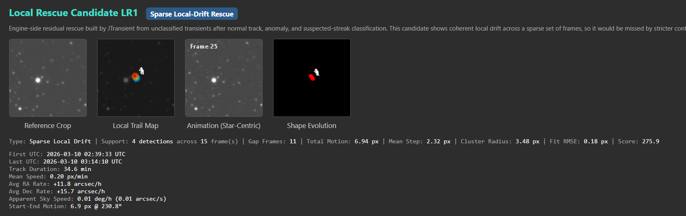
 *Sample Detection - asteroid Sutoku (data credit Klangwolke @ Cloudynights)*

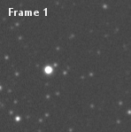
 *Sample Detection - asteroid Sutoku (data credit Klangwolke @ Cloudynights)*

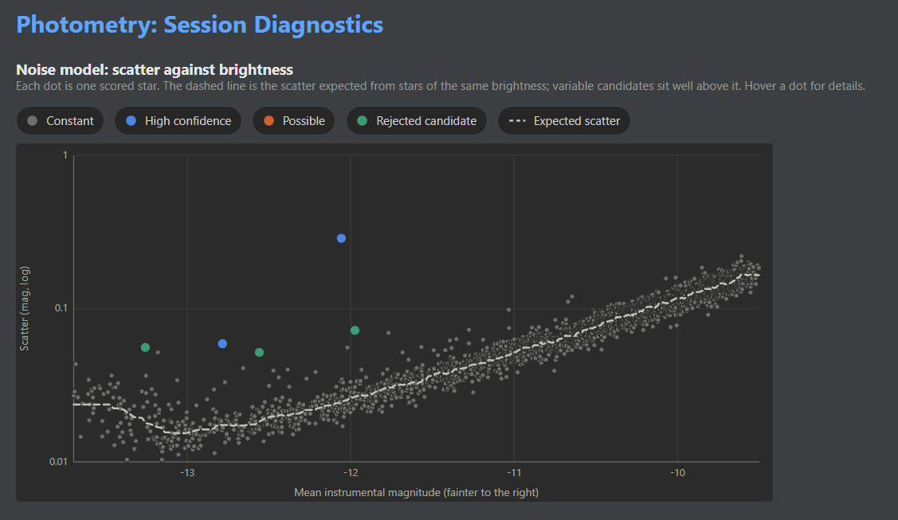
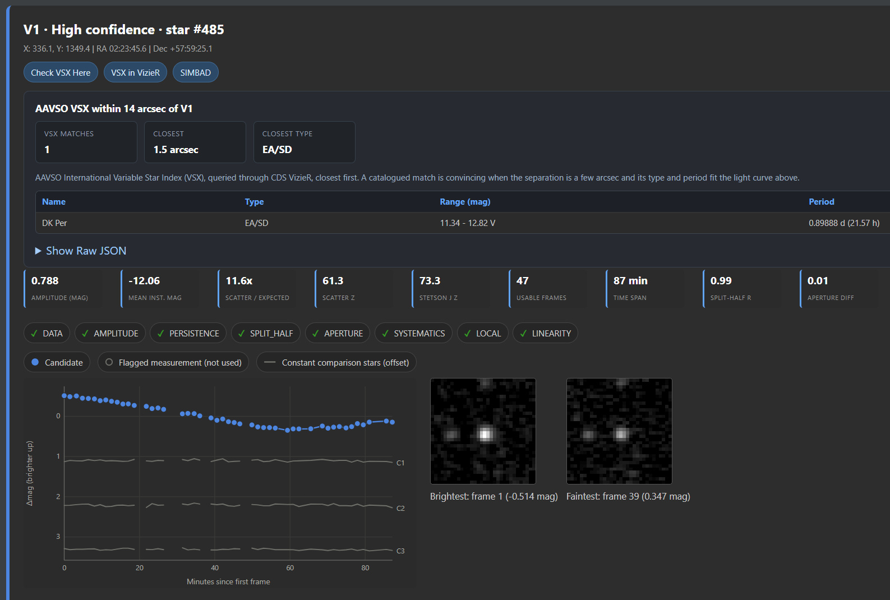
 *Sample Detection - Variable star DK Per*

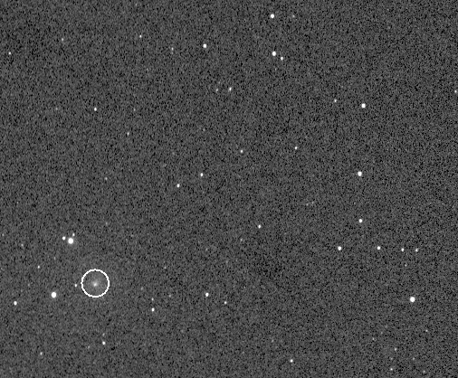
 *Sample Detection - Comet Africano 2019*

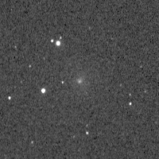
 *Sample Detection - Comet Africano 2019*

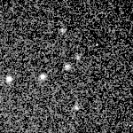
*Sample Detection - Apophis asteroid 2021 (raw images credit Duncan Warren), object-centric view.*

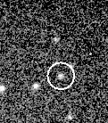
 *Sample Detection - Apophis asteroid 2021 (raw images credit Duncan Warren), star-centric view.*

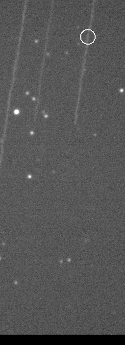
 *Sample Detection - streak track.*

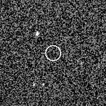
  *Sample Detection - high-energy anomaly, data credit cloudynights user TheStarsabove.*

## Video Tutorial

<a href="https://youtu.be/7XBdYh0Wn7A?si=ymQmXHg92X651RmZ" target="_blank">
  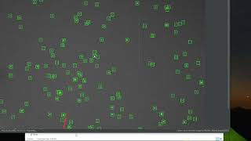
</a>

[Watch the video tutorial on YouTube](https://youtu.be/7XBdYh0Wn7A?si=ymQmXHg92X651RmZ)

*A new tutorial using the latest version is on the way.*

## JTransient engine documentation

SpacePixels uses the [JTransient Engine](https://github.com/ppissias/JTransient) for the core extraction, purification, and track-linking pipeline.

For the underlying detection logic and the meaning of the engine configuration options, see:

- [JTransient repository](https://github.com/ppissias/JTransient)
- [JTransient algorithm overview](https://github.com/ppissias/JTransient/blob/main/ALGORITHM.md)
- [JTransient configuration reference](https://github.com/ppissias/JTransient/blob/main/CONFIG.md)
- [JTransient auto-tuners](https://github.com/ppissias/JTransient/blob/main/AUTOTUNER.md)
- [JTransient variable-star photometry](https://github.com/ppissias/JTransient/blob/main/VariableStarAlgorithm.md)

## What SpacePixels does

- Runs a standard multi-frame detection pipeline for moving targets, streak tracks, single-frame streaks, and bright anomalies.
- Reviews maximum-stack elongated morphology candidates using geometric shape and exact median-mask overlap filters; these are not confirmed moving tracks.
- Provides an iterative detection mode for large datasets and very slow targets.
- Auto-tunes the detection settings for each session. The default calibrated tuner measures false detections and sensitivity on the session's own frames and offers four profiles: low, medium, high (the default) and maximum (as sensitive as possible, for small sensors or targeted searches for a faint object). The original score-based tuner is still available.
- Optionally measures the photometry of the stationary stars and reports variable-star candidates with light curves, readiness checks and a lookup in the AAVSO VSX catalogue. Switch it on with the `Variable-star photometry` checkbox next to the Detect button; plate-solve one frame so candidates can be matched against VSX.
- Generates an HTML report with diagnostics, GIFs, geometric overlays, global maps, object-identification links, and optional AI-themed summary sections.
- Supports manual transient inspection and frame-by-frame single-image detection preview.
- Blinks aligned frames for traditional visual inspection.
- Plate-solves images through ASTAP or Astrometry.net and uses WCS for RA/Dec overlays, SkyBoT/JPL moving-object identification, SatChecker satellite identification for streaks, and Stellarium Web context links.
- Batch-converts color FITS to monochrome and batch-stretches imported datasets.
- Includes headless utilities for batch detection.

## Java API

The supported Java integration surface is [`eu.startales.spacepixels.api`](src/main/java/eu/startales/spacepixels/api).

For setup, request/result behavior, and usage examples, see [API.md](API.md).

## Input requirements

- Best results come from aligned, calibrated sub-exposures where the star field is already registered.
- All frames in a sequence should share the same dimensions.
- The GUI can import FITS directories (`.fit`, `.fits`, `.fts`). Directories containing XISF files and no native FITS files are converted to 16-bit monochrome FITS during import. Compressed `.fz` inputs are detected and can be decompressed into a new directory during import.
- The GUI can also standardize 32-bit FITS data down to 16-bit during import when needed.
- Automated detection requires 16-bit monochrome frames. If you import color images, use `Convert to Mono` before running the detection pipelines.
- The headless batch detector is stricter than the GUI: it expects uncompressed 16-bit monochrome FITS files.

## Installation and launch

SpacePixels requires Java 21 or newer.

<strong>Prerequisite:</strong> Java 21 must be installed on your system.

  Please make sure you have Java 21 installed. Download Java: 
  <a href="https://www.oracle.com/java/technologies/downloads/" target="_blank" rel="noopener noreferrer">
    Oracle Java
  </a> or
  <a href="https://adoptium.net/temurin/releases/?version=21" target="_blank" rel="noopener noreferrer">
    Eclipse Temurin
  </a>
  

### Running a release build

Download the latest packaged release from:

[SpacePixels Releases](https://github.com/ppissias/SpacePixels/releases)

Then unzip / untar and run:

- Windows: `StartSpacePixels.bat`
- Linux/macOS: `./StartSpacePixels`

### Running from source

From the project root:

- Windows: `gradlew.bat run`
- Linux/macOS: `./gradlew run`

To generate a local distribution with launch scripts:

- Windows: `gradlew.bat installDist`
- Linux/macOS: `./gradlew installDist`

## Typical GUI workflow

1. Import a directory of aligned FITS files, or a XISF-only directory, with `Import Aligned Frames…` (the first button of the `1 Prepare` group), or drop the folder onto the window.
2. If the sequence is compressed or 32-bit, let SpacePixels decompress or standardize it first.
3. If the sequence is color, run `Convert to Mono` (group 1 Prepare).
4. Optionally configure ASTAP and observatory metadata in the `Astrometry Config` tab, and plate-solve one frame (group 2 Astrometry) so the report can identify asteroids (JPL, SkyBoT) and variable stars (AAVSO VSX).
5. Optionally adjust the display stretch in the `Image Stretch` tab (used by Blink, the full-size viewer and the optional stretched copies; detection always uses the linear data).
6. Run Auto-Tune on the `Overview` page of the `Detection Settings` tab (one run measures all four profiles; pick one in the table), or adjust the settings by hand.
7. Run either:
   - `Detect Moving Targets` (the standard pipeline, Ctrl+D), optionally with `Variable-star photometry` ticked, or
   - `Detect Iteratively (large datasets)` for large datasets where the standard full run may be too heavy.
8. When the run finishes, SpacePixels prompts you to open the generated HTML report or, for iterative runs, the results folder containing the per-pass reports.

## Report output

The standard pipeline exports an HTML session report plus PNG and GIF assets. Depending on the data and configuration, the report can include:

- A session header (field, time span, frames, camera, plate-solve status), a sticky section navigation and an overview whose cards jump to each result
- Target visualizations for moving tracks, streak tracks, single-frame streaks, and anomalies
- WCS-aware identification helpers: SkyBoT and JPL Small-Body Identification for moving-object tracks, SatChecker for streak tracks, and Stellarium Web sky-context links for both moving tracks and streaks
- Deep-stack anomalies and maximum-stack streak hints
- Global trajectory and transient maps
- Interactive unclassified-transient map with time-colored source footprints and markers, metadata, and a zoomed inspection view that animates the detection frame and the two nearest quality-checked frames on either side
- Variable-star photometry (when enabled): readiness verdict with its reasons, checks and star/frame funnels, noise model, per-frame diagnostics, a candidate table with "Identify all in VSX", candidate light curves, CSV exports
- Collapsed diagnostics: astrometric context, frame quality control and rejected frames, the detection configuration (values that differ from the defaults highlighted, exported as `detection_config.json`), star mask, dither and drift, extraction, star removal and track linking
- Optional AI perspective sections: Codex's "Signal Weave" and Claude's "The Night, Retold" (a timeline of the session and a short account of it)

The AI creative sections are controlled by a session-only checkbox in `Detection Settings -> Report Visualization -> Optional Report Sections`. They are off by default and are not persisted with the saved detection profile.

## Command-line utilities

`build.gradle` keeps the generated application launcher in `bin`, adds dedicated command-line tool launchers there, and ships top-level `StartSpacePixels` wrappers that delegate to the generated launcher.

After building or unpacking a distribution, you should find:

- Release root:
  - `StartSpacePixels.bat`
  - `StartSpacePixels`
- Windows:
  - `bin\\SpacePixels.bat`
  - `bin\\batchDetect.bat`
  - `bin\\injectStars.bat`
  - `config\\default_detection_profile.json`
- Linux/macOS:
  - `bin/SpacePixels`
  - `bin/batchDetect`
  - `bin/injectStars`
  - `config/default_detection_profile.json`

### Headless batch detection

Use either the packaged `batchDetect` launcher or the Gradle task.

Packaged launcher examples:

- Windows:
  - `bin\\batchDetect.bat "C:\\astro\\sequence" "config\\default_detection_profile.json"`
  - `bin\\batchDetect.bat "C:\\astro\\sequence" "config\\default_detection_profile.json" --auto-tune high`
- Linux/macOS:
  - `bin/batchDetect "/data/sequence" "config/default_detection_profile.json" --auto-tune high`

Gradle task examples:

- Windows:
  - `gradlew.bat batchDetect -PbatchArgs="\"C:\\astro\\sequence\" \"src\\dist\\config\\default_detection_profile.json\""`
  - `gradlew.bat batchDetect -PbatchArgs="\"C:\\astro\\sequence\" \"src\\dist\\config\\default_detection_profile.json\" --auto-tune high"`
- Linux/macOS:
  - `./gradlew batchDetect -PbatchArgs="\"/data/sequence\" \"src/dist/config/default_detection_profile.json\" --auto-tune high"`

`batchDetect` accepts a SpacePixels detection-profile JSON and can optionally run Auto-Tune with `low`, `medium`, `high` or `maximum` (the earlier names conservative, balanced and aggressive still work), using `--tuner calibrated` (default) or `--tuner legacy`.

With the Gradle task, `-PbatchMaxHeap=8g` sets a fixed JVM heap instead of the default of up to 80% of RAM. Large sessions (for example 33 frames of 61 megapixels) need about 11 GB.

### Artificial star injection

Use either the packaged `injectStars` launcher or the Gradle task.

Packaged launcher examples:

- Windows:
  - `bin\\injectStars.bat C:\\astro\\sequence 15 10.0 4500 4.0`
- Linux/macOS:
  - `bin/injectStars /data/sequence 15 10.0 4500 4.0`

Gradle task examples:

- Windows:
  - `gradlew.bat injectStars -PinjArgs="C:\\astro\\sequence 15 10.0 4500 4.0"`
- Linux/macOS:
  - `./gradlew injectStars -PinjArgs="/data/sequence 15 10.0 4500 4.0"`

This utility injects synthetic moving stars into a FITS sequence for testing and validation.

## Testing

- `gradlew test` runs the unit tests. `-PtestMaxHeap=6g` gives the test JVM a larger heap for the opt-in real-data diagnostics.
- `gradlew realDataTest -PrealDataRoot=<folder>` runs the opt-in real-data integration tests against local datasets outside the repository.
- `AutoTunerRealDataDiagnosticsIT` prints the calibrated auto-tuner's report for one dataset without running the pipeline. It is skipped unless `SPACEPIXELS_TUNER_DATASET` points to an aligned 16-bit FITS folder (optionally `SPACEPIXELS_TUNER_PROFILE` for a base profile and `SPACEPIXELS_TUNER_PREPARE=1` to convert colour or float input first).

## Publishing

Maven Central publishing instructions now live in [PUBLISHING.md](PUBLISHING.md).
